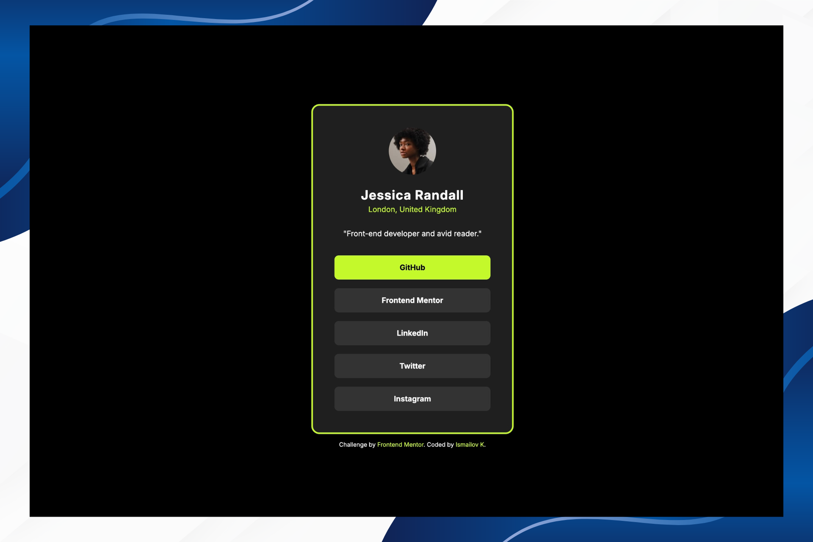

# Frontend Mentor - Social Links Profile Solution

### Screenshot



This is a solution to the [Social links profile challenge on Frontend Mentor](https://www.frontendmentor.io/challenges/social-links-profile-UG32l9m6dQ).

## Table of contents

- [Overview](#overview)
  - [The challenge](#the-challenge)
  - [Links](#links)
- [My process](#my-process)
  - [Built with](#built-with)
  - [What I learned](#what-i-learned)
  - [Continued development](#continued-development)
  - [AI Collaboration](#ai-collaboration)
- [Author](#author)

## Overview

### The challenge

Users should be able to:

- See hover and focus states for all interactive elements on the page

### Links

- Solution URL: https://github.com/Ismail-SWE/Social-Links-Profile
- Live Site URL: https://ismail-swe.github.io/Social-Links-Profile/

## My process

### Built with

- Semantic HTML5
- CSS3
- Flexbox
- Google Fonts (Inter)
- Mobile-first workflow

### What I learned

Using `<address>` semantic element for location and removing default italic style:
```css
.profile-location {
    font-style: normal;
}
```

Replacing `<button>` elements with `<a>` tags for social links — buttons are for actions, links are for navigation:
```html
<a href="https://github.com" target="_blank" class="profile-link">GitHub</a>
```

Using `max-width` with `margin: 0 auto` to control text width independently from other elements:
```css
.profile-profession {
    max-width: 18rem;
    margin: 0 auto;
}
```

Flex items stretch to fill parent width by default — `display: block` and `width: 100%` are unnecessary inside a flex column container:
```css
.profile-links {
    display: flex;
    flex-direction: column; /* children automatically stretch to full width */
}
```

Using `object-fit: cover` to keep image proportions inside a fixed container:
```css
.profile-image img {
    width: 88px;
    height: 88px;
    object-fit: cover;
}
```

Using `gap` instead of `margin-bottom` for spacing between flex children:
```css
.profile-links {
    gap: 1rem; /* cleaner than adding margin to each child */
}
```

### Continued development

- CSS Grid
- JavaScript
- React

### AI Collaboration

- Used Claude (Anthropic) for code review and debugging
- All code was written by me — Claude helped identify errors and explain concepts
- Particularly helpful for understanding semantic HTML, CSS best practices, and responsive design

## Author

- Frontend Mentor - [@IsmailovK](https://www.frontendmentor.io/profile/IsmailovK)
- GitHub - [@Ismail-SWE](https://github.com/Ismail-SWE)
